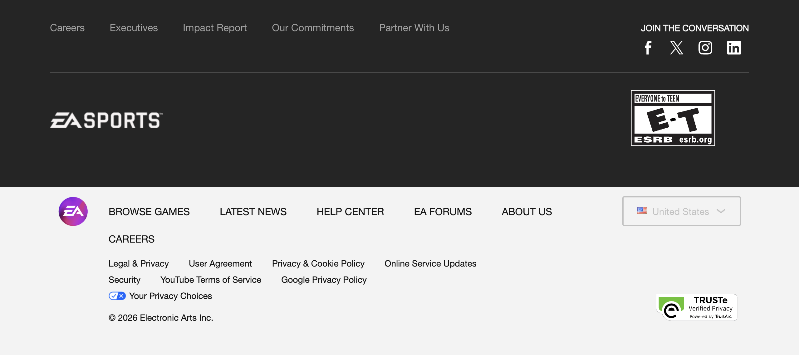

<html lang="en">
<head>
<meta charset="UTF-8">
<title>Help Center Demo</title>
<meta name="viewport" content="width=device-width, initial-scale=1">

</head>

<body>

<header>
  
Help Center Demo

  

    <input placeholder="Search help articles">
  

  <button class="signin-btn">Sign In</button>
</header>

<section class="hero">
  <h1>How can we help?</h1>
  

    <input id="searchBox" placeholder="Search topics, errors, features">
  

</section>

<h2>Browse Categories</h2>

  
Account & Login

  
Payments

  
Integrations

  
Developer APIs

<h2>Feature Gallery</h2>

  

  

  

  

  

  

  

  

  

<h2 style="margin-top:40px;">Popular Articles</h2>

  <h3>Still need help?</h3>
  <button class="primary">Open Case</button>
  <button class="outline">Start Chat</button>

<footer>
Demo Help Center UI — Built for Feature Demonstrations
</footer>

</body>
</html>
